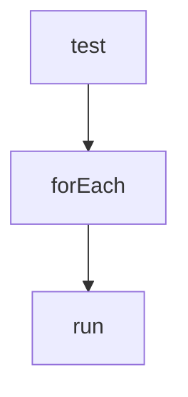

# 5장 고급 함수와 함수형 프로그래밍 활용하기

## 5.1 코틀린을 활용한 함수형 프로그래밍

### 5.1.1 고차 함수

* 고차 함수는 함수 파라미터로 람다를 받는 함수를 말합니다.

정수 배열의 원소 합계를 계산하는 함수를 정의하면 다음과 같습니다.

```Kotlin
fun sum(numbers: IntArray): Int{
    var result = numbers.firstOrNull() ?: throw IllegalArgumentException("Empty array")
    
    for(i in 1..numbers.lastIndex) result+=numbers[i]
    
    return result
}
```

람다를 통해 함수를 더 일반화해서 집계 함수를 적용할 수 있습니다.


```Kotlin
fun aggregate(numbers: IntArray, op: (Int, Int) -> Int) :Int{
    var result = numbers.firstOrNull() ?: throw IllegalArgumentException("Empty array")
    
    for(i in 1..numbers.lastIndex) result = op(result, numbers[i])
    
    return result
}

fun sum(numbers: IntArray) = aggregate(numbers, { result, op -> result + op }
```

### 5.1.2 함수 타입

* 함수 타입은 함수처럼 쓰일 수 있는 값들을 표시하는 타입입니다.
* 문법적으로 함수 타입은 함수 시그니처와 비슷하며, 다음과 같은 두 가지 부분으로 구성됩니다.
  * 괄호로 둘러싸인 파라미터 타입 목록은 함수값과 전달될 데이터의 종류와 수를 정의합니다.
  * 반환 타입은 함수 타입의 함숫값을 호출하면 돌려받게 되는 값의 타입을 정의합니다.
* 반환값이 없는 함수 타입에서는 반환 타입을 반드시 명시해야 합니다. 즉 Unit을 반환해야 합니다.
* 코틀린에서 자바에서의 함수형 인터페이스(SAM 인터페이스)를 사용하려면 fun 키워드를 인터페이스 앞에 추가하면 됩니다.
```fun interface StringConsumer ...```
* 함수 타입을 정의할 때, 파라미터 타입을 둘러싼 괄호는 필수입니다.
* 함수 타입을 정의할 때, 타입을 명시하지 않고 람다를 통해서만 정의를 한다면, 람다의 파라미터에 타입을 명시해줘야 합니다.
* 함수 타입을 다른 함수 타입 안에 내포시켜 고차 함수의 타입을 정의할 수 있습니다.

### 5.1.3 람다와 익명 함수

* 람다식은 다음과 같은 구성요소를 가집니다.
  * 파라미터 목록 : result, op
  * 람다식의 몸통이 되는 식이나 문의 목록 : result + op
* 함수 정의와 달리 반환 타입을 지정할 필요가 없으며, 람다식 본문으로부터 반환 타입이 자동으로 추론됩니다.
* 람다는 파라미터의 목록을 괄호로 둘러쌀 필요가 없습니다.
* 람다의 파라미트를 괄호로 둘러싸면 구조 분해 선언이 됩니다.
* 람다에 파라미터가 없다면 화살표를 생략해도 됩니다.
* 파라미터가 단 하나라면 **it** 키워드를 통해 해당 파라미터에 접근할 수 있습니다.

```println(check("hello") {it.isLowerCase()})```

* 사용하지 않는 파라미터가 있다면 밑줄(_)으로 선언할 수 있습니다.

```println(check("hello"){>,c -> c.isLetter() })```

* 익명 함수를 통해 함숫값을 만들 수 있습니다.
* 익명 함수의 문법은 일반 함수 문법과 거의 비슷합니다.
  * 익명 함수에는 이름을 지정하지 않습니다. 따라서 fun 키워드 다음에 바로 파라미터 목록이 옵니다.
  * 람다와 마찬가지로 문맥에서 파라미터 타입을 추론할 수 있으면 파라미터 타입을 지정하지 않아도 됩니다.
  * 함수 정의와 달리, 익명 함수는 식이기 때문에 인자로 넘기거나 변수에 대입하는 등 일반 값처럼 쓸 수 있습니다.
  * 람다와 달리 반환 타입을 명시할 수 있습니다.

### 5.1.4 호출 가능 참조

* 코틀린에서는 이미 존재하는 함수 정의를 함수 타입의 식으로 사용할 수 있는 호출 가능 참조(::)를 제공합니다.

```Kotlin
fun main(){
    println(check("hello",  ::isCapitalLetter))
    println(check("hello") {it.isCapitalLetter})
}
```
* 호출 가능 참조는 오버로딩된 함수를 구분할 수 없습니다. 오버로딩된 함수를 구분하기 위해 타입을 지정해줘야 합니다.
* 코틀린은 프로퍼티에 대한 호출 가능 참조를 만들 수 있습니다. 이런 참조는 실제로 함숫값이 아닌 리플랙션 객체입니다.

```Kotlin
fun main(){
    val person = Person("John", "Doe")
    val readName = person::fisrtName.getter
    val writeFamily = person::familyName.setter
    
    println(readName())
    writeFamily("smith")
    println(readName())
```

* 코틀린의 호출 가능 참조는 자바의 메소드 참조와 비슷하지만, 자바와는 다르게 일급 객체이며 다양한 타입을 가질 수 있습니다.

### 5.1.5 인라인 함수와 프로퍼티

* 고차 함수와 함수값을 사용하면 함수가 객체로 표현되기에 성능 차원에서 부가 비용이 발생합니다.
* 익명 함수나 람다가 외부 영역의 변수를 참조하면 고차 함수에 함숫값을 넘길 때마다 외부 영역의 변수를 포획할 수 있는 구조로 만들어져야 합니다.
* 코틀린에서는 inline 키워드를 통해 함수의 호출하는 부분을 해당 함수의 본문으로 대체할 수 있습니다.

```Kotlin
inline fun indexOf(numbers: IntArray, condition: (Int) -> Boolean) : Int{
    for(i in numbers.indices) {
        if (condition(numbers[i])) return i
    }
    return -1
}

fun main(){
    println(indexOf(intArrayOf(4,3,2,1)) { it < 3})
}
```

```Kotlin
fun main(){
    val numbers = intArrayOf(4,3,2,1)
    var index = -1
    
    for( i in numbers.indices){
        if(numbers[i] < 3){
            index = i
            break
        }
    }
    
    println(index)
}
```

* 인라인 함수는 대상 함수가 상대적으로 작은 경우 성능이 크게 향상됩니다.
* 인라인 함수는 다음과 같은 제약을 가지고 있습니다.
  * 인라인 함수는 실행 시점에 별도의 존재가 아니기에 변수에 저장되거나 인라인 함수가 아닌 함수에 전달될 수 없습니다.
  * 함수가 널이 될 수 있는 함수 타입의 인자를 받을 수 없습니다.
    * noinline을 통해 특정 람드를 인라인하지 말라고 지정할 수 있습니다.
* 인라인 함수는 캡슐화를 깨지 않기 위해, private 멤버를 전달하는 것을 금지합니다.
* 프로퍼티 자체를 인라인화 하는 경우 게터와 세터를 모두 인라인해줍니다.
  * 프로퍼티에 대한 인라인은 뒷받침하는 필드가 없는 프로퍼티에만 적용가능합니다.

### 5.1.6 비지역적 제어 흐름

* 람다 내부에서 return을 사용할 경우 람다가 존재하는 가장 안쪽 함수의 제어 흐름을 변경시키기에 사용할 수 없습니다. 이를 비지역 반환이라고 합니다.
* 익명 함수를 이용해서 return을 지정할 수 있습니다.
* 람다 자체로부터 제어 흐름을 반환하고 싶다면 레이블을 지정해줘야 합니다.
* 람다가 인라인될 경우에는 return을 사용할 수 있습니다. 고차 함수가 인라인 함수라면 고차 함수를 호출하는 코드를 함수 본문과 람다 본문으로 대체하기에 return을 사용할 수 있습니다.

```Kotlin
inline fun forEach(a: IntArray, action: (Int) -> Unit){
    for(i in a){
        action(i)
    }
}


class Test{
    fun test(){
        forEach(intArrayOf(1, 2, 3)){
            if(it == 2) return
            println(it)
        }
    }
}
```

```Java
public final class Test {
   public final void test() {
      int[] a$iv = new int[]{1, 2, 3};
      a$iv = a$iv;
      int $i$f$forEach = false;
      int var3 = 0;

      for(int var4 = a$iv.length; var3 < var4; ++var3) {
         int i$iv = a$iv[var3];
         int it = i$iv;
         int var7 = false;
         if (it == 2) {
            return; // test 함수 내부에서 호출
         }

         System.out.println(it);
      }

   }
}
```

* 고차 함수가 인라인 될 수 있는 람다를 받을 때, 고차 함수의 정의에서 지역 클래스나 지역 함수에서 람다를 호출할 수 있습니다.
이때에도 람다를 인라인할 수 있지만, 람다에서 return을 호출하더라도 고차 함수의 호출을 끝낼 수 없습니다.
이는 람다의 return과 람다를 실행해주는 함수가 서로 다른 실행 스택 프레임을 차지하기 때문입니다.

```Kotlin
inline fun forEach(a: IntArray, action: (Int) -> Unit) = object{
    fun run(){
        for(n in a){
            action(n)
        }
    }
}
```

```Java
public final class Test {
   public final void test() { // 스택 프레임
      int[] a$iv = new int[]{1, 2, 3};
      a$iv = a$iv;
      int $i$f$forEach = false;
      new Test$test$$inlined$forEach$1(a$iv); 
   }
}
public final class TestKt {
   @NotNull
   public static final Object forEach(@NotNull final int[] a, @NotNull final Function1 action) { // 스택 프레임
      Intrinsics.checkNotNullParameter(a, "a");
      Intrinsics.checkNotNullParameter(action, "action");
      int $i$f$forEach = false;
      return new Object() {
         public final void run() { // 스텍 프레임
            int[] var1 = a;
            int var2 = 0;

            for(int var3 = var1.length; var2 < var3; ++var2) {
               int i = var1[var2];
               action.invoke(i);
            }

         }
      };
   }
}
```

* 스텍 프레임은 다음과 같은 구조를 가지게 됩니다.



* 위 스택 프레임 구조로 인해 람다에서의 return 문은 가장 안쪽 함수인 run 함수를 종료시킬 뿐입니다. 
* 앞선 호출을 가능하게 하기위해서는 람다에서 비지역 return을 사용하지 못하게하는 crossinline을 함수형 파라미터 앞에 추가해야 합니다.


## 5.2 확장

### 5.2.1 확장 함수

* 확장 함수는 어떤 클래스의 멤버인 것처럼 호출할 수 있는 함수를 뜻합니다.
* 확장함수를 정의할 때, 수신 객체의 클래스이름을 선언하고, 점(.)과 메소드 이름을 추가하면 함수를 추가할 수 있습니다.
* 확장 함수 자체는 수신 객체가 속한 타입의 캡슐화를 깰 수 없습니다. 즉, 확장함수를 정의할 때,private 멤버에 접근할 수 없습니다.
* 확장 함수를 클래스 본문안에 정의하는 경우 private 멤버에 접근할 수 있습니다.
* 확장 함수를 참조(::)로 사용할 수 있습니다.
* 확장 함수를 정의할 때, 기존에 존재하는 함수와 시그니처가 같다면 원래 정의되어 있던 함수를 우선적으로 선택합니다.
* 확장 함수를 정의하고 이후 멤버 함수로 정의하게 되면, 기존에 존재하던 모든 호출이 의미가 달라집니다.
* 지역 확장 함수를 정의할 수 있습니다. 지역 확장 함수를 사용할 때, 본 객체를 참조하려면 한정자(@)와 this를 통해 가져올 수 있습니다. 한정자 뒤에는 함수 이름을 명시해야 합니다.

```Kotlin
interface Truncated{
    val truncated: String
    val original: String
}

private fun String.truncator(max: Int) = object: Truncated{
    override val truncated
        get() = if(length<=max) this@truncator else substring(0,max)
        
    override val original
        get() = this@truncator
}
```

* 확장 함수는 일반 함수를 클래스 멤버인 것처럼 사용할 수 있게 해주는 편의 문법입니다.
* 널이 될 수 있는 타입에 대해서도 확장을 정의할 수 있습니다.

## 5.3 확장 프로퍼티

* 코틀린에서는 확장 함수처럼 확장 프로퍼티를 지원합니다.

```Kotlin
val IntRange.leftHalf : IntRange
    get() = start..(start+endInclusive)
```

* 확장 함수와의 차이는 인스턴스에 안정적으로 상태를 추가할 방법이 없기에 뒷받침하는 필드를 쓸 수 없습니다. 즉, 초기화할 수 없으며, 접근자 안에서 field를 사용할 수 없습니다. 또한 lateinit도 사용할 수 없습니다.