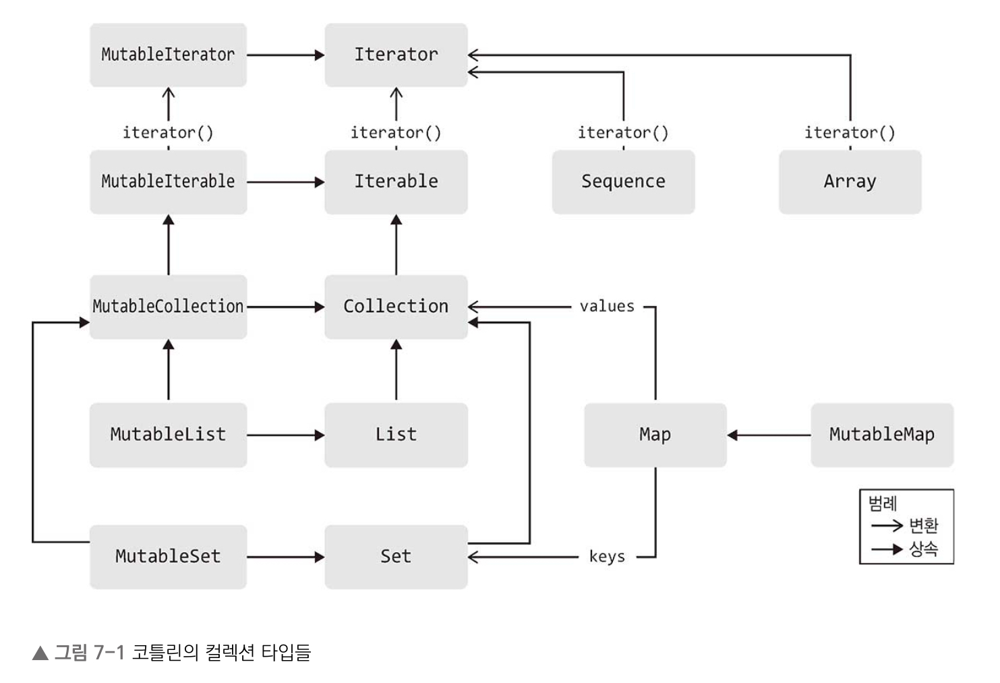

# 7장 컬렉션 I/O 자세히 알아보기

## 7.1 컬렉션

### 7.1.1 컬렉션 타입

* 코틀린 컬렉션 타입은 기본적으로 네 가지로 분류할 수 있습니다.
  * 배열
  * 이터러블
  * 시퀀스
  * 맵
* 배열과 비슷하게 털렉션 타입도 제네릭 타입입니다.



#### 이터러블

* 이터러블은 Iterable<T> 타입으로 표현되며, 일반적으로 즉시 계산되는 상태가 있는 컬렉션을 표현합니다.
* 즉시 계산한다는 것은 컬렉션을 최초로 생성할 때 초기화된다는 뜻입니다.
* 코틀린의 이터러블은 불변 컬렉션과 가변 컬렉션을 구분합니다.
  * 컬렉션의 변경 가능성은 컬렉션 인스턴스에 대한 참조를 저장하는 변수의 변경 가능성과 관계 없습니다.
* 가변 이터러블의 기본 타입은 MutableIterable로 표현됩니다.
* 불변 컬렉션 타입에서 유용한 특징으로는 공변성이 있습니다.
  * 즉, 이터러블에 타입을 지정할 때, 파라미터 타입의 하위타입이면 Iterable의 타입도 하위타입입니다.
* 가변 컬렉션은 공변성을 제공해주지 않습니다.

#### 컬렉션, 리스트, 집합

* 이터러블의 하위 분류 중에는 Collection 인터페이스로 표현되는 타입과 MutableCollection으로 표현되는 타입들이 있습니다.
  * 리스트 : List와 MutableList로 표현되며, LinkedList, ArrayList가 있습니다.
  * 집합(set) : HashSet, LinkedHashSet, TreeSet으로 제공됩니다.

#### 시퀀스

* 이터러블과 비슷하게 시퀀스도 iterator() 메소드를 제공합니다.
* 시퀀스는 지연 계산을 가정하기 때문에 iterator()의 의도가 이터러블과 다릅니다.
* 이터러블과 달리 시퀀스 구현은 내부적이므로 외부에서 직접 사용할 수 없습니다.

#### 맵

* 맵은 키와 값 쌍으로 이뤄진 집합입니다. 이때 키-값 쌍을 Map.Entry, MutableMap.MutableEntry을 통해 접근할 수 있습니다.
* 맵은 HashMap, LinkedHashMap, TreeMap을 제공합니다.


### 7.1.2 Comparable과 Comparator

* Comparable 인스턴스는 자연적인 순서를 지원하며, 동일한 타입의 인스턴스와 비교할 수 있는 compareTo 메소드를 제공합니다.
* 클래스를 여러 가지 방법으로 비교해야할 경우, Comparator를 통해 구현할 수 있습니다.
* compareBy()나 compareByDescending()을 통해서 대상 객체 대신 사용할 수 있습니다.

### 7.1.3 컬렉션 생성하기

* 컬렉션 클래스의 인스턴스를 생성할 수 있는 메소드는 다음과 같습니다.
  * emptyList()/emptySet() : 불변인 빈 리스트/집합 인스턴스를 생성합니다.
  * listOf()/setOf() : 인자로 제공한 배열에 기반한 불변 리스트/집합 인스턴스를 만듭니다.
  * listOfNotNull() : 널인 값을 걸러내고 남은 원소들로 이뤄진 불변 리스트를 만듭니다.
  * mutableListOf()/mutablSetOf() : 가변 리스트/집합의 디폴트 구현 인스턴스를 만듭니다.(ArrayList와 LinkedHashSet을 사용)
  * arrayListOf() : 새로운 ArrayList를 만듬
  * hashSetOf()/linkedSetOf()/sortedSetOf(): HashSet/LinkedHashSet/TreeSet의 인스턴스를 만듭니다.
* 맵의 인스턴스를 생성하는 메소드는 다음과 같습니다.
  * emptyMap() : 빈 불변 맵을 만듭니다.
  * mapOf() : 새 불변 맵을 만듭니다(LinkedHashMap)
  * mutableMapOf() : 가변 맵의 디폴트 구현 인스턴스를 만듭니다.(LinkedHashMap)
  * hashMapOf()/linkedMapOf()/sortedMapOf() : HashMap/LinkedHashMap/TreeMap의 인스턴스를 만듦
* 맵에 원소를 추가할 때, pair 또는 인덱스 연산자([])를 통해서 원소를 추가할 수 있습니다.
* generateSequence() 메소드를 통해서 시퀀스를 만들 수 있습니다.
  * 파라미터가 없는 함수를 인자로 넘김으로써 생성할 수 있습니다.
  * 초깃값을 지정해주고, 지정한 초깃값을 통해 값을 생성합니다.
* yield, yieldAll 메소드를 통해서 시퀀스를 빌드할 수 있습니다. 이때 원소가 지연계산되기에 주의해야 합니다.
* 컬렉션 사이의 변환을 처리하는 함수가 존재합니다.
  * toSet(), toSortedSet(), toList(), toMap()
  * to로 시작하는 함수는 원본 컬렉션의 복사본을 생성합니다.
  * as로 싲가하는 함수는 원본 컬렉션이 변경되는 경우 이를 반영하는 뷰를 만들어줍니다.

### 7.1.4 기본 컬렉션 연산

* 대부분의 컬렉션은 iterator를 통해 원소에 접근할 수 있습니다. Map의 경우 Map.Entry를 원소에 접근할 수 있습니다. 이때 구조분해를 사용할 수 있습니다.
* forEach() 확장 함수를 통해 컬렉션의 각 원소를 제공하면서 인자로 받은 람다를 실행해줍니다.
* MutableCollection 타입은 원소를 추가하거나 제거할 수 있는 메소드를 제공합니다.
  * add, remove,addAll,removeAll,clear
  * +=,-= 사용가능
* 불변컬렉션과 가변 컬렉션 모두 +와 - 연산을 제공해줍니다. 이때 연산과정에서 새로운 컬렉션이 생성됩니다.
* 리스트는 배열과 비슷하게 원소를 인덱스로 접근할 수 있습니다.
  * list.get(idx)
  * list[idx]
  * list.indexOf(value)
  * list.lastIndexOf(value)
* subList() 함수는 시작 인덱스와 끝 인덱스로 지정한 리스트의 일부분에 대한 래퍼를 만듭니다.
  * 이는 뷰를 만드는 것이기 때문에 데이터를 공유합니다.

### 7.1.5 컬렉션 원소에 접근하기

* first()/last() 함수는 각각의 컬렉션의 첫 번째와 마지막 원소를 반환합니다. 이때 컬렉션이 비어있으면 NoSuchElementException이 발생합니다.
* 원소가 없으면 널을 반환하는 안전한 버전인 firstOrNull()/lastOrNull()도 있습니다.
* single() 함수는 싱글턴 컬렉션의 원소를 반환합니다. 안전한 버전인 singleOrNull()은 예외 대신 널을 반환합니다.
* elementAt() 함수를 통해 인덱스를 사용해 컬렉션의 원소를 읽을 수 있습니다. 이때 인덱스의 범위를 넘어서면 예외가 발생하는 데, elementAtOrNull()을 통해 널을 반환 받을 수 있습니다.
elementAtOrElse()를 통해서 지정된 람다를 반환하도록 할 수 있습니다.

### 7.1.6 컬렉션에 대한 조건 검사

* all(), none(), any()를 통해 특정 조건을 만족하는 컬랙션인지 확인할 수 있습니다.

### 7.1.7 집계

* 집계함수는 세 가진 기본 그룹으로 나눌 수 있습니다.
  * 합계, 최솟값, 최댓값 등 자주 쓰이는 집계값을 계산합니다.
    * count()
      * 원소의 갯수가 Int의 최대크기보다 클경우 예외가 발생합니다.
      * 람다를 파라미텉로 넘겨 해당 조건을 만족하는 원소의 수를 반환할 수 있습니다.
    * sum()
    * average()
      * 반환 타입은 항상 Double입니다.
      * 컬렉션이 비어있다면 항상 Double.NaN을 반환합니다.
    * minOrNull(), maxOrNull()
    * minByOrNull(), maxByOrNull()
      * 비교 가능한 값으로 원소를 변환해주는 함수를 제공
    * minWithOrNull(), maxWithOrNull()
      * 변환 함수 대신 Comparator를 파라미터로 받습니다.
  * 컬렉션 원소를 문자열로 엮는 일을 담당합니다.
    * joinToString()
      * 람다를 통해 표현할 값의 진수를 변경할 수 있습니다.
      * seperator : 인접한 두 원소 사이에 들어갈 구분 문자열
      * prefix, postfix : 문자열의 맨 앞과 뒤에 들어갈 문자열
      * limit : 최대로 보여줄 수 있는 원소의 개수 
      * truncated : limit가 양수인 경우 컬렉션의 원소를 모두 표현하지 못할 때 이 파라미터를 추가함
    * joinTo()
      * 문자열을 새로 생성하는 대신 파라미터로 받은 Appendable(StringBuilder) 객체 뒤에 추가해줍니다.
  * 임의의 집계 방식을 구현해주는 함수입니다.
    * reduce()
      * reduce() 함수는 파라미터가 두 개인 함수를 받습니다. 첫 번째 인자는 누적된 값, 두 번째 인자는 컬렉션의 현재 값
        * 누적 값음 최초에 컬렉션의 첫 번째 원소로 초기화됩니다.
        * 컬렉션의 매 원소에 대해 현재 누적값과 현재 원소를 파라미터로 받은 함수에 적용하고 이 함수 적용의 결과를 누적값에 대입합니다.
        * 누적 결과를 반환합니다.
    * reduceIndexed()
      * 집계 규칙이 원소의 인덱스에 따라 달라질 때 사용할 수 있습니다.
    * fold()/foldIndexed()
      * 누적값을 컬렉션 원소의 타입과 다른 타입의 값으로 만들 수 있습니다.

### 7.1.8 걸러내기

* 코틀린에서는 특정 조건을 만족하지 않는 원소를 걸러낼 수 있는 함수를 제공합니다. 예로는 filter 함수가 있습니다.
* filter 함수를 배열, 이터러블, 맵, 시퀀스에 적용할 수 있으며, 각각의 반환 타입은 다음과 같습니다.
  * Array<T>나 iterable<T>를 거르면 List<T>를 얻습니다.
  * Map<K,V>를 거르면 Map<K,V>를 얻습니다.
  * Sequence<T>를 거르면 Sequence<T>를 얻습니다.
* 키나 값만 걸러내고 싶다면 filterKeys()나 filterValues()를 사용하면 됩니다.
* filterNot()을 통해 조건을 만족하는 원소를 제거합니다.
* filterIndexed를 통해 인덱스를 통해 원소를 걸러낼 수 있습니다. 하지만 맵을 적용할 수 없습니다.
* filterNotNull()을 통해 널인 원소를 걷어낼 수 있습니다.
* filterTo()와 같이 To가 붙은 함수를 사용하면 걸러낸 결과를 이미 존재하는 가변 컬렉션에 넣을 수 있습니다.
* 주어진 조건에 대해 만족하는 컬렉션과 만족하지 않는 컬렉션의 쌍을 만들어주는 partition() 함수를 제공합니다.

### 7.1.9 변환

* 매핑은 주어진 함수를 원본 컬렉션의 각 원소에 적용합니다.
* map()과 mapIndexed()는 배열, 이터러블, 시퀀스 맵을 포함한 모든 컬렉션에서 제공합니다.
* map() 함수는 맵에도 적용할 수 있는데, mapKeys(), mapValues() 함수를 통해 키와 값만을 변경할 수 있습니다.
* flatMap()은 여러 컬렉션을 하나의 컬렉션으로만들어 줍니다. 이를 좀 더 간단하게 만든 flatten() 함수도 있습니다.
* flatMap()과 map() 모두 To가 붙은 메소드를 제공합니다. 이는 연산의 결과를 기존 컬렉션에 추가해줍니다.
* associateWith()를 통해 컬렉션을 키의 값으로하는 맵을 만들 수 있습니다. 이와 반대로 컬렉션의 원소를 값으로하는 associateBy()함수를 제공해줍니다.
* associate() 함수는 컬렉션의 원소를 사용해서 키와 값을 만들어냅니다.

### 7.1.10 하위 컬렉션 추출

* slice() 함수를 통해 리스트와 배열의 부분을 추출할 수 있습니다.
* sliceArray()를 통해 배열 원소를 다른 배열로 추출할 수 있습니다.
* take(), takeLast() 함수는 이터러블이나 배열에서 원소를 주어진 개수만큼 추출합니다.
* drop(), dropLast()는 take(), takeLast()을 반전시킨 연산입니다.
* chunked()를 사용하면 이터러블이나 시퀀스를 주어진 개수를 넘지 않는 작은 리스트들로 나눠줍니다.
* windowed() 함수를 사용하면 일정한 간격으로 청크를 연속적으로 얻어낸 슬라이딩 윈도우를 얻을 수 있습니다.
  * 슬라이딩 윈도우를 생성하는 큐칙을 정하는 선택적 파라미터를 제공합니다.
    * step: 서로 인접한 윈도우의 첫 번째 원소 사이의 거리
    * partialWindows : 컬렉션의 마지막 부분에서 지정한 윈도우 크기보다 작은 크기의 윈도우를 포함시킬지 여부
* 원소가 두 개뿐인 윈도우를 만들 때, zipWithNext()라는 별도의 함수를 통해 만들 수 있습니다.

### 7.1.11 순서

* 코틀린에는 기본적으로 배열, 이터러블, 시퀀스에 적용할 수 있는 정렬 함수인 sorted()를 제공합니다. 이는 오름차순으로 원소를 정렬해줍니다.
* sortedDescending()은 내림차순으로 정렬해줍니다.
* 정렬 함수를 배열이나 이터러블에 대해 적용하면 항상 list가 나옵니다.
* 컬렉션 원소가 비교 가능하지 않아도, 순서를 제공함으로써 sorted()를 대체할 수 있는 sortedBy(), sortedWith()를 제공합니다.
  * sortedBy()는 컬렉션 원소를 비교할 타입을 지정합니다.
  * sortedWith()는 Comparator를 파라미터로 받습니다.
* reversed() 함수를 통해 원본 컬렉션의 원소를 역순으로 나열해 반환해줍니다. 이와 비슷한 asReversed()가 있는데, 이는 원본 리스트의 데이터를 공유합니다. 즉, 래퍼를 만들어줍니다.
* suffled()는 이터러블에 적용하면 임의의 순서대로 재배치한 새 리스트를 만들어 줍니다.


## 7.2 파일과 I/O 스트림

### 7.2.1 스트림 유틸리티

* 코틀린 표준 라이브러리는 자바 I/O 스트림에 대한 도우미 확장을 다수 제공합니다.
  * 도우미 확장 함수들은 스트림 콘텐츠에 대한 접근을 단수화해주고 복사, 자동 스트림 정리등과 같은 복잡한 사용 패턴을 구현해줍니다.

```Kotlin
fun InputStream.readBytes(): ByteArray
fun Reader.readText(): String
fun Reader.readLines(): Line<String>
```

* BufferedReader의 readLine() 메소드는 스트림의 한 줄만 가져오지만, readText()/readLines()는 스트림 끝까지 콘텐츠를 읽어옵니다.
* 코틀린은 버퍼가 있는 스트림에 대한 직접 이터레이션을 허용합니다. 하지만 이진 데이터와 텍스트 데이터에 대한 API는 다릅니다.

```Kotlin
FileInputStream("data.bin").buffered().use { // 버퍼 interator
  var sum = 0
  for ( byte in it) sum+=byte
}

FileReader("data.bin").buffered().use { // 각 줄로 이뤄진 시퀀스를 반환하는 lineSequence()
  for(line in it.lineSequence()) println(line)
}
```

* Reader 인스턴스도 forEachLine()과 useLines() 함수를 통해 줄 단위 이터페이션을 허용합니다.
  * forEachLine()에 전달되는 람다는 이터레이션이 진행되면서 한 줄씩 데이터를 인자로 전달받음
  * useLines()에 전달되는 람다는 모든 라인에 대한 시퀀스를 인자로 받음

```Kotlin
fun main(){
  FileWriter("data.txt").use { it.write("One\nTwo\nThree") }
  
  FileReader("data.txt").useLines { println(it.joinToString()) }
  
  FileReader("data.txt").forEachLine { print("$it\") } 
```

* copyTo() 함수를 통해 한 스트림에서 다른 스트림으로 데이터를 전달할 수 있습니다.

```Kotlin
fun InputStream.copyTo(
  out: OutputStream,
  bufferSize: Int = DEFUALT_BUFFER_SIZE
): Long

fun Reader.copyTo(out: Writer, bufferSize: Int = DEFUALT_BUFFER_SIZE): Long
```


* use() 함수는 자바 Closeable 타입의 값에 대해 호출할 수 있으며 AutoCloseable에도 적용할 수 있습니다.
* use() 함수는 인자로 전달 받은 람다를 실행하고 나서 마지막에 자원을 적절히 정리해줍니다.


### 7.2.2 스트림 생성

* 코틀린에서는 자바 I/O 스트림을 편하게 만들 수 있는 함수들을 제공합니다.
  * bufferedReaders()/bufferedWriter() : File 객체애 대한 BufferedReader, BufferedWriter 인스턴스를 생성할 수 있습니다.
  * reader()/writer() : 버퍼가 없는 FileReader/FileWriter 객체를 만듬
  * printWriter() : 형식화된 출력에 적합한 PrintWriter 인스턴스를 만듬
* reader/writer 관련 함수를 사용할 때 선택적으로 인코딩 문자 집합을 지정할 수 있습니다.
* 버퍼를 사용하는 reader/writer 관련 함수들을 호출할 때, 버퍼의 크기를 지정할 수 있습니다.
* byteInputStream() 함수를 통해 주어진 문자열을 원본으로하는 ByteArrayInputStream 인스턴스를 생성합니다. 
* inputStream()을 통해 주어진 바이트 배열을 원본으로 하는 ByteArrayInputStream 인스턴스를 만듭니다.
  * inputStream()에 오프셋과 크기를 파라미터로 넘겨주면 바이트 배열의 일부를 사용해 스트림을 만들 수 있습니다.
* InputStream을 바탕으로 reader(), bufferedReader(), buffered() 함수를 통해 Reader, BufferedReader, BufferedInputStream을 만들 수 있습니다.
* OutputStream을 Writer, BufferedWriter, BufferedOutputStream에 연결할 때 사용할 수 있는 함수를 제공합니다.(writer(), bufferedWriter(), buffered())
* Reader와 Writer에 대해 정의된 buffered() 함수도 있습니다.


### 7,2.3 URL 유틸리티

* 코틀린 표준 라이브러리는 URL 객체의 주소로부터 네트워크 연결을 통해 데이터를 읽어오는 몇 가지 도우미 함수를 제공합니다.

```Kotlin
fun URL.readText(charset: Charset = Charsets.UTF_8): String // url 인스턴스에 해당하는 입력 스트림의 콘텐츠를 전부 읽어옴
fun URL.readBytes(): ByteArray // 이진 스트림의 콘텐츠를 바이트 배열로 읽어옴
```

* 두 함수 모두 전체 데이터를 읽어오는 작업이 완료될 때까지 스레드를 블럭시키기에 큰 파일을 다운로드할 때 조심해야 합니다.

### 7.2.4 파일 콘텐츠 접근하기

* 텍스트 콘텐츠를 처리할 때는 다음 함수를 사용할 수 있습니다.
  * readText() : 파일 콘텐츠 전부를 한 문자열로 읽어옵니다.
  * readLines() : 파일 콘텐츠 전부를 줄 구분 문자를 사용해 줄 단위로 나눠 읽어서 문자열의 리스트를 반환합니다.
  * writeText() : 파일 콘텐츠를 주어진 문자열로 설정합니다. 필요하면 파일을 덮어 씁니다.
  * appendText() : 주어진 문자열을 파일의 콘텐츠 뒤에 추가합니다.
* 파일 콘텐츠를 처리하게 해주는 다른 함수들은 파일을 전부 읽지 않고 블록 안에서 조금씩 처리할 수 있게 해줍니다.
* forEachLine()  함수를 통해 콘텐츠를 한 줄씩 처리할 수 있습니다.
* 이진 파일을 처리할 때는 forEachBlock() 함수를 사용합니다.
  * forEachBlock() 함수가 받는 람다는 ByteArray와 이터레이션에서 버퍼 안에 들어있는 바이트의 크기를 정수로 알려줍니다.

### 7.2.5 파일 시스템 유틸리티

* deleteRecursively() 함수를 사용하면 파일이나 디렉터리를 자신에게 포함된 자손들까지 포함해 쉽게 지울 수 있습니다.
  * 함수 삭제가 성공하면 true, 아니면 false를 반환합니다.
  * false를 반환한경우 자식 디렉터리는 안 지워지는 등 파일 중 일부만 지워졌을 수 있습니다.
* copyTo() 함수는 자신의 수신 객체를 다른 파일에 복사하고 복사본을 가리키는 파일 객체를 돌려줍니다.
  * 디폴트로 대상 파일을 덮어 쓰지 않습니다. 또한 이를 overwrite를 지정할 수 있습니다.
  * copyTo() 함수를 디렉터리에 적용할 수 있습니다. 하지만 하위 파일을 복사하지 않으며, 빈 디렉터를 생성할뿐입니다.
    * 디렉터리의 내용물을 모두 복사하기 위해서는 copyRecursively()를 사용해야 합니다.
    * copyTo()와 마찬가지로 copyRecursively()에도 voerwrite 파라미터를 통해 덮어 쓸지 여부를 정해줄 수 있습니다.
* 선택적인 OnError 파라미터를 통해 IOException가 발생했을 때 호출할 액션을 지정할 수 있습니다.
  * (File, IOException) -> OnErrorAction
  * 람다의 결괏값은 copyRecursively() 함수가 문제가 되는 파일을 어떻게 처리할지를 결정합니다.
  * SKIP : 파일을 무시하고 복사를 계속 진행
  * TERMINATE : 복사를 중단
* walk() 함수는 깊이 우선 디렉터리 구조 순회를 구현합니다.
  * 순화 방향을 결정하는 파라미터가 있습니다.
    * TOP_DOWN : 자식보다 부모를 먼저 방문
    * BOTTOM_UP : 자식을 부모보다 먼저 방문
  * walk(TOP_DOWN) 대신 walkTopDown()을 사용할 수 있습니다.
  * walk(BOTTOM_UP) 대신 walkBottomUp()을 쓸 수 있습니다.
  * walk() 함수가 반환하는 시퀀스는 특별한 FileTreeWalk 클래스에 속합니다. 해당 클래스는 일반적인 시퀀스 기능과 더불어 별도의 순회 옵션을 지정할 수 있게 해줍니다.
  * maxDepth()를 통해 하위 트리의 최대 깊이를 지정할 수 있습니다.
  * onEnter()와 onLeave()는 순회가 디렉터리에 들어가거나 디렉터리에서 나올 때 호출할 동작을 지정합니다.
    * 디폴트로 onEnter()는 항상 true를 반환하고, onLeave()는 아무 일도 하지 않으며, onFail()은 예외를 던집니다.
* createTempFile()/createTempDir() 함수를 통해 임시 파일이나 디렉터리를 만들 수 있습니다.
