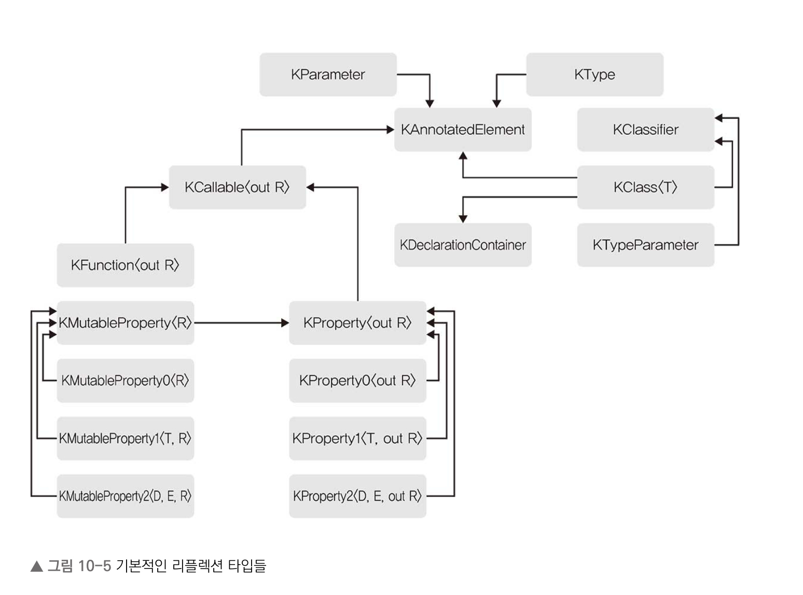

# 10장 애너테이션과 리플랙션

## 10.1 애너테이션

* 애너테이션은 커스텀 메타데이터를 정의하고 이 메타데이터를 소스코드상의 선언, 식, 전체 파일 등의 요소를 엮는 방법을 제공합니다.

### 10.1.1 애너테이션 클래스 정의하고 사용하기

* 애너테이션 사용 문법은 자바와 비슷합니다.

```kotlin
class MyTestCase{
    @Test fun testTrue() { assertTrue(true) }
    @Test fun testFalse() { assertFalse(false) }
}
```

* 코틀린에서는 자바와 달리 애너테이션을 식에 적용할 수 있습니다.
* 애너테이션을 주 생성자에 적용하고 싶을 때는 명시적으로 주생성자의 인자 목록 앞에 constructor 키워드를 붙여야 합니다.
* 애너테이션을 정의하려면 클래스 앞에 annotation 키워드를 붙여야 합니다.
    * 애너테이션 클래스는 멤버나 부생성자, 초기화 코드가 없습니다.
    * 코틀린 1.3부터는 내포된 클래스, 인터페이스, 객체를 애너테이션 본문에 넣을 수 있습니다.

```kotlin
annotation class Test
```

* 애너테이션에 커스텀 애트리뷰트를 추가하고 싶다면 생성자 파라미터를 통해야만 합니다.
    * 항상 val로 선언해야 합니다.

```Kotlin
annotation class Test(val param: String)
```

* 애너테이션에는 디폴트 값이나 가변 인자를 사용할 수 있습니다.
* 애너테이션은 클래스의 일종이지만 인스턴스화할 수 없습니다.
* 애너테이션은 자동으로 Any 클래스와 빈 Annotation 인터페이스를 자동으로 상속합니다.
* 애너테이션 인자는 컴파일시에만 평가되기 때문에 애너테이션 인자에 임의의 식을 넣을 수 없습니다.
* 애너테이션 인자로 사용할 수 있는 타입은 다음과 같습니다.
    * 원시 타입
    * String
    * enum
    * 다른 애너테이션
    * 클래스 리터럴
    * 위에 나열한 타입들로 이뤄진 배열
* 다른 애너테이션을 인자로 사용하는 경우 @ 접두사를 안 붙여도 됩니다.
* 애너테이션의 인자를 넘길때는 arrayOf()나 `[]`를 통해 배열을 만들어야 합니다.
* 클래스 리터럴을 만들기 위해서는 ::class를 사용합니다.

```Kotlin
annotation class Test(val param: String, val arg: KClass<*>)

@Test("hello", String::class)
class TestClass
```

* 코틀린에서는 여러 요소가 함축적으로 들어있는 선언에 대해서 애너테이션을 적용할 수 있습니다. 이를 통해 특정 요소에 대해서 적용할 수 있습니다.

```Kotlin
class Person(@get:A val name: String)
```

* 사용 지점 대상은 다음과 같습니다.
    * property: 프로퍼티
    * field: 프로퍼티의 백킹 필드
    * get: 게터
    * set: 세터
    * param: 생성자 파라미터
    * setparam: 세터 파라미터
    * delegate: 위임 프로퍼티의 위임 인스턴스를 감싸는 프로퍼티
* receiver라는 대상을 사용하면 확장 함수나 프로퍼티의 수신 객체에 애너테이션을 붙일 수 있습니다.

```Kotlin
fun @receiver:A Person.fullName() = "$firstName $lastName"
```

* file이라는 대상을 사용해 전체 파일에 대해 애너테이션을 붙일 수 있습니다.

```Kotlin
@file:JvmName("StringFunctions")
...
fun main(){
  println("Hello, World!")
}
```
* 런타임에 최상위 함수와 프로퍼티가 들어가는 파일 퍼사드 클래스 안에 파일 애너테이션이 남습니다.

### 10.1.2 내장 애너테이션

* 코틀린은 내장 애너테이션을 제공하며 컴파일러 수준에서 특별한 의미를 가집니다.
* @Retention 애너테이션은 애너테이션이 저장되고 유지되는 방식을 제어합니다.
  * SOURCE: 컴파일러가 애너테이션을 처리한 후 버려집니다.
  * BINARY: 컴파일러가 애너테이션을 바이트 코드에 저장하지만 런타임에는 리플렉션 API로 관찰할 수 없습니다.
  * RUNTIME: 애너테이션을 바이트 코드에 저장하고 런타임에 리플렉션 API로 관찰할 수 있습니다.
* @Repeatable은 언어 요소에 두 번 이상 반복 적용할 수 있습니다.
  * 기본적으로 애너테이션은 두 번 이상 적용할 수 없습니다.

```Kotlin
@Repeatable
@Retention(RUNTIME)
annotation class Test(val param: String)

@Test("hello")
@Test("world")
class TestClass
```

* @MustBeDocumented는 애너테이션을 API 문서에 표시하도록 지정합니다.
* @Target은 애너테이션은 어떤 요소에 붙일 수 있는지 지정합니다.
  * CLASS: 클래스, 인터페이스, 객체, 어노테이션 클래스
  * ANNOTATION_CLASS: 어노테이션 클래스
  * TYPEALIAS: 타입 별칭
  * PROPERTY: 프로퍼티
  * FIELD: 프로퍼티의 백킹 필드
  * LOCAL_VARIABLE: 지역 변수
  * VALUE_PARAMETER: 함수나 생성자의 파라미터
  * CONSTRUCTOR: 클래스 생성자
  * FUNCTION: 람다나 익명 함수를 포함하는 함수에 붙일 수 있음
  * PROPERTY_GETTER/PROPERTY_SETTER: 프로퍼티의 게터나 세터
  * FILE: 파일
  * TYPE: 타입 사용. 변수의 타입이나 함수의 파라미터 타입, 반환 타입등을 포함한다.
  * EXPRESSION: 표현식
  * TYPE_PARAMETER라는 상수를 지원하지 않지만, 예약되어 있습니다.
* @Target을 지정하지 않으면 타입 별칭, 타입 파라미터, 타입 지정, 식, 파일을 제외한 언어 요소에 애너테이션을 적용할 수 있습니다.
* 코틀린은 자바와 달리 패키지 수준의 애너테이션을 지원하지 않습니다. 하지만 소스 파일 수준에서 정의할 수 있습니다.
* 다음 애너테이션은 이름이 같은 자바 변경자와 같은 역할을 합니다.
  * @StrictFp: 부동 소수점 연산을 제한하여 다른 플랫폼간의 부동소수점 연산 이식성을 높여줍니다.
  * @Synchronized: 메소드나 블록을 동기화합니다.
  * @Volatile: 뒷받침 필드를 변경한 내용을 즉시 다른 스레드에서 관찰할 수 있습니다.
  * @Transient: 직렬화에서 제외합니다.
* @Suppress 애너테이션을 사용하면 지정한 이름의 컴파일러 경고를 표시하지 않게 할 수 있습니다.
  * 해당 애너테이션은 자신이 붙은 요소 내부에 있는 모든 코드에 적용됩니다.
* @Deprecated 애너테이션은 사용자에게 사용 금지 예정이라고 선언하며, 사용하지 않는 것을 권장합니다.
  * ReplaceWith를 통해서 대체할 수 있는 함수를 지정할 수 있습니다.
  * ReplaceWith 또한 애노테이션이지만 단독으로 사용할 수 없습니다.
  * DeprecationLevel을 통해 사용자에게 경고 수준을 지정할 수 있습니다.
    * WARNING: 경고
    * ERROR: 컴파일 오류
    * HIDDEN: 사용자에게 보이지 않음


## 10.2 리플렉션

* 리플랙션 API는 클래스, 함수, 프로퍼티의 런타임 표현에 접근할 수 있게 해주는 타입, 함수, 프로퍼티의 모음입니다.

### 10.2.1 리플랙션 API 개요

* 리플랙션 관련 클래스는 kotlin.reflect 패키지에 들어있고, 크게 두 가지 그룹으로 나눌 수 있습니다.
  * 호출 가능 그룹은 프로퍼티와 함수를 표현합니다.
  * 지정자 그룹은 클래스나 타입 파라미터의 런타임 표현을 제공합니다.



* 모든 리플랙션 타입은 KAnnotatedElement의 자손입니다.
  * KAnnotatedElement는 함수, 프로퍼티, 클래스 등 구체적인 언어 요소에 정의된 애너테이션에 접근하는 기능을 제공합니다.
  * KAnnotatedElement는 애너테이션 인스턴스로 이뤄진 프로퍼티 하나만 있습니다.

```Kotlin
annotation class Dependency(vararg val componentClasses: KClass<*>)

annotation class Component(
  val name: String = "Core",
  val dependency: Dependency = Dependency()
}

@Component("I/O")
class IO

@Component("Log", Dependency(IO::class))
class Log

@Component(dependency = Dependency(IO::class, Log::class
class Main


fun main(){
  val component = Main::class.annotations
    .filterIsInstance<Component>()
    .firstOrNull() ?: return
    
  println("name: ${component.name}")
  
  val depText = component.dependency.componentClasses.joinToString { it.simpleName ?: "" }
  
  println("dependency: $depText")
  
  // Component name: Core
  // Dependency: IO, Log
}
```

### 10.2.2 지정자와 타입

* 코틀린 리플랙션에서 지정자는 타입을 정의하는 선언을 뜻합니다. 이는 KClassifier 인터페이스에 의해 표현됩니다.
* KClassifier는 두 가지 하위 타입이 존재합니다.
  * KClass<T> : 컴파일 시점에 T 타입인 클래스나 인터페이스, 객체 선언을 런타임에 표현한다.
  * KTypeParameter : 어떤 제네릭 선언의 타입 파라미터를 표현한다.
* 현재 타입 별명을 표현하는 리플렉션 API는 없습니다.
* KClass를 얻는 방법은 클래스 리터럴 구문을 사용하거나, kotlin 확장 프로퍼티를 이용해서 얻을 수 있습니다.

```Kotlin
println(String::class) // 리터럴

val stringClass = Class.forName("java.lang.String").kotlin
println(stringClass) // 확장 프로퍼티
```

* KClass 멤버 중 첫 번쨰 그룹은 대상 클래스에 어떤 변경자가 붙어있는지를 알아낼 수 있게 해줍니다.

```Kotlin
val isAbstract : Boolean
val isCompanion : Boolean
val isData : Boolean
val isFinal : Boolean
val isInner : Boolean
val isOpen : Boolean
val isSealed : Boolean
```

* visibility라는 프로퍼티는 클래스의 가시성을 나타냅니다.
  * 코틀린 소스코드에서 가시성을 표현할 수 없다면 visibility는 null을 반환합니다.

```Kotlin
enum class KVisibility{
  INTERNAL,
  PRIVATE,
  PROTECTED,
  PUBLIC
}
```

* jvmName 확장 프로퍼티를 사용하면 자바 관점에서 보는 클래스 전체 이름을 돌려줍니다.
* isInstance를 사용하면 클래스의 인스턴스인지 확인할 수 있습니다.
* 다음 KClass 프로퍼티들은 멤버 선언에 접근할 수 있습니다.
  * constructors : 주생성자와 부생성자들을 KFunction 타입의 인스턴스로 돌려준다.
  * members: 클래스의 멤버들을 KCallable 타입의 인스턴스로 돌려준다.
  * nestedClasses: 중첩 클래스들을 KClass 타입의 인스턴스로 돌려준다. 동반 객체도 포함된다.
  * typeParameters: 클래스의 타입 파라미터들을 KTypeParameter 타입의 인스턴스로 돌려준다.
* KClass에서는 supertypes 프로퍼티를 통해 얻을 수 있는 KType 인스턴스의 리스트는 클래스의 상속 구조를 나타낸다.
* KTypeParameter는 상당히 단순하며 프로퍼티를 네 개만 제공합니다.
  * upperBounds는 KClass의 supertypes 프로퍼티와 비슷하게 상위 바운드 타입으로 이뤄진 리스트를 돌려줍니다.
  * variance는 타입 파라미터의 변성을 나타내는 KVariance 이넘을 돌려줍니다.

```Kotlin
val isReified: Boolean
val name: String
val upperBounds: List<KType>
val variance: KVariance
```


* 코틀린 리플렉션이 KType 인터페이스를 통해 타입을 표현하는데, 코틀린의 타입은 다음 세 가지 성격을 가집니다.
  * isMarkedNullable: 타입이 널이 될 수 있는지 여부를 나타냅니다.
  * classifier: 타입의 클래스나 인터페이스를 나타냅니다.
  * 타입 프로퍼티에 전달된 실제 타입 인자 목록
* 타입 인자가 타입 자체와 타입의 사용 지점 변성을 함께 포함하는 KTypeProjection 인터페이스에 의해 표현될 수 있습니다.

### 10.2.3 호출 가능

* 호출 가능 요소라는 개념은 어떤 결과를 얻기 위해 호출할 수 있는 함수나 프로퍼티를 함께 묶어줍니다.
* 리플렉션 API에서는 KCallable<out R>이라는 제네릭 인터페이스를 통해 호출 가능 요소를 표현합니다.
* KCallable은 KClass와 마찬가지로 어떤 변경자가 붙어 있는지 알아낼 수 있는 프로퍼티들이 존재합니다.

```Kotlin
val isAbstract: Boolean
val isFinal: Boolean
val isOpen: Boolean
val isSuspend: Boolean
val visibility: KVisibility?
```

* KCallable은 프로퍼티나 함수의 시그니처를 표현하는 프로퍼티가 속한 그룹이 있습니다.

```Kotlin
val name: String
val typeParameters: List<KTypeParameter>
val parameters: List<KParameter>
val returnType: KType
```

* KParameter 인터페이스는 멤버 및 확장 선언이 수신 객체나 함수/생성자의 파라미터의 대한 정보를 포함합니다.

```Kotlin
val index: Int
val isOptional: Boolean
val isVararg: Boolean
val name: String?
val type: KType
val kind: KParameter
```

* isOptional은 파라미터가 디폴트 값을 가지는지 여부를 나타냅니다.
* kind 프로퍼티는 파라미터가 일반 파라미터인지 수신 객체인지 나타냅니다.
  * KParameter.Kind는 다음과 같은 값들을 가질 수 있습니다.
    * VALUE: 일반 파라미터
    * EXTENSION_RECEIVER: 수신 객체
    * INSTANCE: 클래스 인스턴스
* KCallable은 호출 가능 요소가 표현하는 호출 가능한 선언을 동적으로 호출할 수 있게해주는 call() 메소드를 제공합니다.
  * callBy()를 통해 맵 형태로 인자를 넘길 수 있습니다.
* KProperty는 프로퍼티에만 있는 변경자를 검사하는 프로퍼티를 제공합니다.

```Kotlin
val isConst: Boolean
val isLateinit: Boolean
```

* 프로퍼티 게터를 KFunction을 통해 접근할 수 있습니다.
* KMutableProperty는 KProperty에 세터를 추가해줍니다.
* KProperty에는 KProperty0, KProperty1, KProperty2라는 하위 타입이 있습니다.
  * KProperty0은 수신 객체가 없는 경우
  * KProperty1은 수신 객체가 하나인 경우
  * KProperty2는 수신 객체가 두 개인 경우
* KFunction은 함수나 생성자를 표현합니다. 이 인터페이스에 추가된 멤버는 모두 함수에 적용 가능한 변경자 검사를 위한 프로퍼티들뿐입니다.

```Kotlin
val isInline: Boolean
val isInfix: Boolean
val isOperator: Boolean
val isSuspend: Boolean
```

* KFunction은 다양한 인자 개수를 지원해야 하므로 어떤 함수 타입도 상속하지 않습니다.
* 리플랙션을 이용하면 가시성이 제한된 호출 가능 요소에 접근할 수 있습니다.