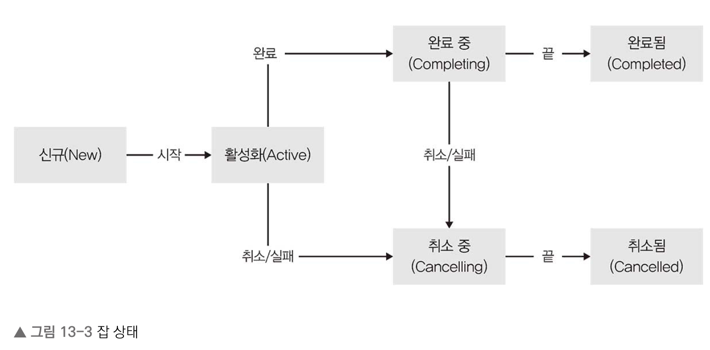

# 13장 동시성

## 13.1 코루틴

* 자바 동시성 요소를 사용하더라도 동시성 연산이 blocking이기에 실행이 끝날때까지 기다려야 합니다. 또한 실행 재개를 위한 콘텍스트 스위치가 필요합니다.
* 앞선 문제를 비동기를 통해서 해결할 수 있지만 구현 코드의 복잡성으로 사용하기 어렵습니다.
* 코틀린은 코루틴을 통해서 동기 코드처럼 비동기 코드를 작성할 수 있습니다.

### 13.1.1 코루틴과 일시 중단 함수

* 전체 코루틴 라이브러리를 뒷받침하는 기본 요소는 일시 중단 함수입니다.
    * 일시 중단 함수는 함수를 더 일반화해 함수 본문의 원하는 지점에서 모든 문맥을 저장한 다음, 원할 때 다시 진행할 수 있도록 한 것입니다.
    * 일시 중단 함수는 suspend 키워드를 사용하여 정의합니다.

```Kotlin
suspend fun foo(){
    println("task start")
    delay(1000)
    println("task end")
}
```

* delay는 코루틴 라이브러리에 정의된 일시 중단 함수이며 이는 현재 스레드를 블럭시키지 않고 다른 작업을 수행할 수 있게 풀어줍니다.
* 일시 중단 함수는 일시 중단 함수와 일반 함수를 원하는 대로 호출할 수 있습니다.
    * 일시 중단 함수를 호출하면 해당 호출 지점이 일시 중단 지점이 됩니다.
    * 일시 중단 지점은 임시로 실행을 중단했다가 나중에 재개할 수 있는 지점을 말합니다.
    * 일반 함수 호출은 일반 함수처럼 작동해서 함수 실행이 다 끝난 뒤 호출한 함수 제어가 돌아옵니다.
* 일반 함수에서 일시 중단 함수를 호출하기 위해서는 코루틴 빌더를 사용해야 합니다.
    * 코투린 빌더는 CoroutineScope 인스턴스의 확장 함수로 쓰입니다.

### 13.1.2 코루틴 빌더

* launch() 함수는 코루틴을 시작하고, 코루틴을 실행 중인 작업의 상태를 추적하고 변경할 수 있는 Job 객체를 돌려줍니다.

```Kotlin
fun main(){
  val time = currentTimeMillis()
  
  GlobalScope.launch{
    delay(1000)
    println("Task 1 finished in ${currentTimeMillis()-time} ms")
  }
  
  GlobalScope.launch{
      delay(1000)
      println("Task 2 finished in ${currentTimeMillis()-time} ms")
  }
  
  Thread.sleep(2000) 
}  
```

* 코루틴은 스레드보다 훨씬 가볍습니다. 특히 코루틴은 유지해야 하는 상태가 더 간단하며
  일시 중단되고 재개될 때 완전한 문맥 전환을 사용하지 않아도 되므로 엄청난 수의 코루틴을 충분히 동시에 실행할 수 있습니다.
* launch() 빌더는 동시성 작업이 결과를 만들어내지 않는 경우 적합합니다.
* async() 빌더는 결과물을 만들어내는 경우 사용합니다.
    * async()는 Deferred의 인스턴스를 반환하고, 이 인스턴스는 Job 하위 타입으로 await() 메소드를 통해 계산 결과에 접근할 수 있도록 해줍니다.
    * await() 메소드를 호출하면 await()는 계산이 완료되거나 계산 작업이 취소될 때까지 현재 코루틴을 일시 중단시킵니다.

```Kotlin
suspend fun main(){
  val message = GlobalScope.async{
    delay(1000)
    "World"
  }
  
  val count = GlobalScope.async{
    delay(1000)
    1 + 2
  }
  
  delay(200)
  
  val result = message.await().repeat(count.await())
  println("Hello, $result")
}
```

* launch와 async 빌더의 경우 스레드 호출을 블럭시키지는 않지만, 백그라운드 스레드를 공유하는 풀을 통해 작업을 실행합니다.
* runBlocking() 빌더는 디폴트로 현재 스레드에서 실행되는 코루틴을 만들고 코루틴이 완료될 때까지 현재 스레드의 실행을 블럭시킵니다.
    * runBlocking()은 다른 코루틴 안에서 사용하면 안됩니다.
    * runBlocking()은 블러킹 호출과 넌블러킹 호출 사이의 다리 역할을 하기 위해 고안된 코루틴 빌더입니다.

### 13.1.3 코루틴 영역과 구조적 동시성

* 앞선 GlobalScope는 전역 영역에서 실행됩니다.
    * 전역 영역은 코루틴의 생명 주기가 전체 애플리케이션의 생명 주기에 의해서만 제약되는 영역입니다.
* 구조적 동시성은 코투린을 다른 코루틴 문맥에서 관리함을 의미합니다.

```Kotlin
fun main(){
  runBlocking{ // 자식 코루틴이 모두 종료될 때까지 대기
    println("Main starts")
    
    launch {
      println("Task A started")
      delay(1000)
      println("Task A finished")
    }
    
    launch {
      println("Task B started")
      delay(1000)
      println("Task B finished")
    }
    
    delay(100)
    println("Main ends")
  }
}
```

* coroutineScope() 호출로 코드 블록을 감싸면 커스텀 영역을 도입할 수 있습니다.
* coroutineScope()는 람다의 결과를 반환하고, 자식들이 완료되기 전까지 실행이 완료되지 않습니다.
* coroutineScope()는 runBlocking()과 다르게 현재 스레드를 블럭시키지 않습니다.
* 부모 자식 관계는 예외 처리와 취소 요청을 공유하는 영역을 정의하는 더 복잡한 코루틴 계층 구조를 만들 수 있습니다.

### 13.1.4 코루틴 문맥

* 코루틴마다 CoroutineContext 인터페이스로 표현되는 문맥이 연관돼 있으며, 코루틴을 감싸는 변수 영역의 coroutineContext 프로퍼티를 통해 이 문맥에 접근할 수 있습니다.
* 코루틴 문맥은 다음과 같은 구성요소로 되어 있습니다.
    * job : 코루틴이 실행 중인 취소 가능한 작업을 표시한 잡
    * dispatcher : 코루틴과 스레드의 연관을 제어하는 디스패처
* 일반적으로 문맥은 CoroutineContext.Element를 구현하는 아무 데이터나 저장할 수 있습니다.

```Kotlin
GlobalScope.lauch{
  println("Task is active: ${coroutineContext[Job.Key]!!.isActive}")
}
```

* 기본적으로 launch(), async() 등의 표준 코루틴 빌더에 의해 만들어지는 코루틴은 현재 문맥을 이어받습니다.
* plus()나 minusKey()를 통해 문맥에 새로운 요소를 추가하거나 제거할 수 있습니다.

```Kotlin
private fun CoroutineScope.showName(){
  println("Current coroutine: ${coroutineContext[CoroutineName]?.name}")
}


fun main(){
  runBlocking{
    showName()
    launch(coroutineContext + CoroutineName("worker")) {
      showName()
    }
  }
}
```

* 코루틴을 실행하는 중간에 withContext()에 새 문맥과 일시 중단 람다를 넘겨서 문맥을 전환시킬 수도 있습니다.

## 13.2 코루틴 흐름 제어와 잡 생명 주기

* 잡은 동시성 작업의 생명 주기를 표현하는 객체입니다.
* 잡을 사용하면 작업 상태를 추적하고 필요할 때 작업을 취소할 수 있습니다.



* 활성화 상태는 작업이 시작됐고 아직 완료나 취소로 끝나지 않았다는 뜻입니다. 이는 디폴트 상태입니다.
* launch(), async()는 CoroutineStart 타입의 인자를 지정해서 잡의 초기 상태를 선택하는 기능을 제공하기도 합니다.
    * CoroutineStart.DEFAULT : 즉시 시작
    * CoroutineStart.LAZY : 잡이 신ㄱ뉴 상태가 되고 시작을 기다림
* 신규 상태의 잡에 대해 start(), join() 메소드를 호출하면 잡이 시작되면서 활성화 상태가 됩니다.

```Kotlin
fun main(){
  runBlocking{
    val job = launch(start = CoroutineStart.LAZY){
      println("Task started")
    }
    
    println("Task is not active: ${job.isActive}")
    
    delay(1000)
    
    job.start()
  }
}
```

* 활성화 상태에서는 코루틴 장치가 잡을 반복적으로 일시 중단하고 재개시킵니다.
* 잡이 다른 잡을 실행시킬 수 있는데, 이 경우 새 잡은 기존 잡의 자식이 됩니다. 이는 트리 형태의 의존 관계를 만듭니다.
* 코루틴은 일시 중단 람다 블록의 실행이 끝나면 잡의 상태는 `완료 중` 상태로 바뀝니다.
* 잡에 join() 메소드를 사용하면 조인 대상 잡이 완료될 때까지 현재 코루틴을 일시 중단시킬 수 있습니다.
* 현재 잡 상태를 잡의 isActive, isCancelled, isCompleted 프로퍼티를 통해 확인할 수 있습니다.

| 잡 상태 | isActive | isCompleted | isCancelled |
|------|----------|-------------|-------------|
| 신규   | false    | false       | false       |
| 활성화  | true     | false       | false       |
| 완료 중 | true     | false       | false       |
| 취소 중 | false    | false       | true        |
| 완료   | false    | true        | false       |
| 취소   | false    | true        | true        |

### 13.2.1 취소

* 잡의 cancel() 메소드를 호출하면 잡을 취소할 수 있습니다.
* 취소 가능한 코루틴은 스스로가 취소가 요청됐는지 검사해서 적절히 반응해줘야 합니다.
  * 적절히 반응하기 위해서는 isActive, isCancelled, isCompleted 프로퍼티를 사용해야 합니다.
  * CancellationException을 통해서 취소에 반응할 수 있게 할 수 있습니다.
* 부모 코루틴이 취소되면 자동으로 모든 자식의 실행을 취소합니다. 이는 부모에게 속한 모든 잡 게층이 취소될 떄까지 계속됩니다.

### 13.2.2 타입아웃

* 경우에 따라 작업이 완료되기를 무작정 기다릴 수 없어 타임아웃을 설정해야할 때 withTimeout()을 사용하면 됩니다.

```Kotlin
fun main()
  runBlocking{
    val asyncData = async { File("data.txt").readText() }
    try{
      val text = withTimeout(50) { asyncData.await() }
      println("Data loaded: $text")
    } catch(e: Exception){
      println("timeout exceede")
    }
  } 
}
```

* withTimeoutOrNull()을 통해 예외 대신 널을 반환할 수 있습니다.

### 13.2.3 코루틴 디스패치하기

* 코루틴은 스레드와 무관하게 일시 중단 가능한 계산을 구현할 수 있게 해주지만, 여전히 스레드와 연관시켜야 합니다.
* 코루틴은 특정 코루틴을 실행할 떄 사용할 스레드를 제어하는 작업을 담당하는 특별한 컴포넌트가 있습니다. 이를 디스패처라고 부릅니다.
* 디스패처는 코루틴 문맥의 일부입니다. 따라서 launch()나 runBlocking() 등의 코루틴 빌더 함수에서 이를 지정할 수 있습니다.

```Kotlin
fun main(){
  runBlocking{
    launch(Dispatcher.Default){
      println(Thread.currentThread().name)
    }
  }
}
```

* 코루틴 디스패처는 병렬 작업 사이에 스레드를 분배해주는 자바 실행기와 비슷합니다.
* ExecutorService의 인스턴스에 asCoroutineDispatcher()를 호출하면 ExecutorCoroutine Dispatcher를 반환합니다.
* 코루틴 라이브러리는 다음과 같은 디스패처를 제공합니다.
  * Dispatchers.Default : CPU 바운드 작업을 위한 스레드 풀
  * Dispatchers.IO : I/O 바운드 작업을 위한 스레드 풀
  * Dispatchers.Main : 안드로이드와 자바FX에서 UI 업데이트를 위한 스레드
* 디스패처를 명시적으로 지정하지 않으면 코루틴을 시작한 영역으로 디스패처가 자동으로 상속됩니다.
* 코루틴 생명 주기 내내 같은 디스패처를 사용할 필요도 없습니다. 디스패처가 코루틴 문맥의 일부이므로 withContext() 함수를 사용해 디스패처를 오버라이드할 수 있습니다.


### 13.2.4 예외 처리

* 예외 처리의 경우, 코루틴 빌더들은 두 가지 기본 전략 중 하나를 따릅니다.
  * launch() 같은 빌더가 선택한 전략으로 예외를 부모 코루틴에 전달합니다.
    * 부모 코루틴이 똑같은 오류로 취소됩니다. 이로인해 부모의 나머지 자식도 모두 취소됩니다.
    * 자식들이 모두 취소되고 나면 부모는 예외를 코루틴 트리의 윗부분으로 전달합니다.

```Kotlin
fun main(){
  runBlocking{
    launch{
      throw Exception("Error in task A")
      println("Task A completed")
    }
    
    launch{
      delay(1000)
      println("Task B completed")
    }
    
    println("Root")
  }
}
```

* 기본적으로 예외는 Thread.uncaughtExceptionHandler에 전달됩니다.
* CoroutineExceptionHandler는 현재 코루틴 문맥과 던져진 예외를 인자로 전달받습니다.
* 핸들러를 사용하기 위해서는 코루틴 빌더에 context 인자로 핸들러를 넘겨줘야 합니다.
* CoroutineExceptionHandler는 전역 영역에서 실행된 코루틴에 대해서만 정의할 수 있으며,
CoroutineExceptionHandler가 정의된 코루틴의 자식에 대해서만 적용됩니다.
* 또 다른 예외 처리 방식으로 async() 빌더를 사용할 때 던져진 예외를 저장했다가 예외가 발생한 계산에 대한 await() 호출을 받았을 때 다시 전지는 것입니다.
* 코루틴 데이터에 접근할 때 예외를 다시 던지는 방식을 채용하는 async와 유사한 빌더들의 경우 CoroutineExceptionHandler를 사용하지 않습니다.
* try-catch를 사용하더라도 예외는 자동으로 전파되기에 이 동작을 변경하기 위해 슈퍼바이저 잡을 사용해야 합니다.
* 슈퍼바이저 잡이 있으면 취소가 아래 방향으로만 전달됩니다.
* 부모 코루틴을 슈퍼바이저로 변환하려면 coroutineScope() 대신 supervisorScope()를 사용하면 됩니다.


```Kotlin
fun main(){
  runBlocking{
    supervisorScope{
      val deferredA = async{
        throw Exception("Error in task A")
        println("Task A completed")
      }
      
      launch{
        delay(1000)
        println("Task B completed")
      }
    }
    
    try{
      deferredA.await()
    } catch(e: Exception){
      println("Caught: $e")
    }
    deferredB.await()
    println("Root")
  }
}
```


* 슈퍼바이저의 동작은 일반 취소에도 적용됩니다. 슈퍼바이저의 자식 중 하나에 cancel() 호출해도 형재 자매나 자신에는 아무런 영향이 없습니다.