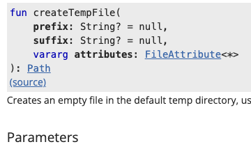

### 7장

## 7.2 파일과 I/O 스트림

### 스트림 유틸리티
코틀린 표준 라이브러리에서는 자바 I/O 스트림에 대한 도우미 확장 함수를 다수 제공한다.

```kotlin
fun InputStream.readBytes(): ByteArray
fun Reader.readText(): String
fun Reader.readLines(): Line<String>
```

다음 함수를 사용하면 스트림의 전체 컨텐츠를 읽어올 수 있다.

readText() / readLines()는 둘 다 스트림 끝까지 컨텐츠를 읽어서 반환하는 함수이다. 차이점은 readLines()는 값을 반환하면서 스트림을 닫아준다.

코틀린은 버퍼가 있는 스트림에 대한 직접 이터레이션을 혀용한다.

BufferedOutputStream의 경우에는 iterator()가 있다. 

```kotlin
FileInputStream("data.bin").buffered().use {
  var sum = 0
  for (byte in it) sum += byte
}
```

BufferedReader에는 각 줄로 이뤄진 시퀀스를 반환하는 lineSequence()가 있다.

```kotlin
FileReader("data.bin").buffered().use {
  for (line in it.lineSequence()) println(line)
}
```

Reader 인스턴스에 대해 forEachLine()과 useLines() 함수는 줄 단위 이터레이션을 허용한다. 두 함수는 스트림을 자동으로 닫는다.

```kotlin
fun main() {
  FileWriter("data.txt").use { it.write("One\nTwo\nThree")}

  FileReader("data.txt").useLines {println(it.joinToString())}

  FileReader("data.txt").forEachLine {print("$it/")}
}
```
---
copyTo() 함수를 사용하면 한 스트림에서 다른 스트림으로 데이터를 전달할 수 있다.

#### use
명시적으로 정리해야 하는 스트림이나 다른 자원을 안전하게 처리할 수 있는 방법으로 use() 함수가 있다. 이 함수는 java.io.Closeable 타입의 값에 대해 호출할 수 있다.

> 이 함수는 try-with-resources와 같은 역할을 한다.

`val reader = FileReader("data.bin")`

이를 자바 코드로 보면 다음과 같다.
```kotlin
val reader = FileReader("data.bin")

val lines = try {
  reader.readLines()
}finally {
  reader.close()
}
```

### 스트림 생성

bufferedReaders() / bufferedWriter() 함수를 이용할 수 있다.

```kotlin
fun main() {
  val file = File("data.txt")

  file.bufferedWriter().use {it.write("Hello!")}
  file.bufferedReader().use {println(it.readLine())}
}
```

이진 파일을 처리하고 싶으면 inputStream / outputStream()을 사용해 적절한 스트림을 생성하면 된다.

```kotlin
fun main() {
  val file = File("data.bin")
  file.outputStream().use {
    it.write("Hello!".toByteArray())
    file.inputStream().use {
      println(String(it.readAllBytes()))
    }
  }}
```

String 이나 ByteArray의 내용에 대한 I/O 스트림을 만드는 함수도 존재한다. byteInputStream() 함수는 주어진 문자열을 원본으로 하는 ByteArrayInputStream 인스턴스를 만든다.

```kotlin
println("Hello".byteInputStream().read().toChar())
println("Hello".byteInputStream(Charsets.US_ASCII).read().thChar())
```

inputStream() 함수는 주어진 바이트 배열을 원본으로 하는 ByteArrayInputStream 인스턴스를 만든다.
`println(byteArrayOf(10, 20, 30).inputStream().read())`

InputStream 클래스의 인스턴스를 바탕으로 Reader, BufferedReader, BufferedInputStream 객체를 만들어 낼 수 있다.

```kotlin
fun InputStream.reader(charset: Charset = Charsets.UTF_8): InputStreamReader

fun InputStream.bufferedReader(charset: Charset = Charsets.UTF_8): BufferedReader

fun InputStream.buffered(bufferSize: Int = DEFAULT_BUFFER_SIZE): BufferedInputStream
```

OutputStream을 Writer, BufferedWriter, BufferedOutputStream에 연결할 때 사용할 수 있는 비슷한 함수도 있다.

```kotlin
fun main() {
  val name = "data.txt"
  FileOutputStream(name).bufferedWriter().use {
    it.write("One\nTwo")
  }

  val line = FileInputStream(name).bufferedReader().use { it.readLine() }

  println(line) // One
}
```
### URL 유틸리티
URL 객체에 대한 다양한 유틸리티도 제공한다.
```kotlin
fun URL.readText(charset: Charset = Charsets.UTF_8): String

fun URL.readBytes(): ByteArray
```

readText() 함수는 URL 인스턴스에 해당하는 입력 스트림의 컨텐츠를 모두 읽어온다. 

readBytes() 함수도 비슷하게 입력 이진 스트림의 컨텐츠를 바이트 배열로 읽어온다.

두 함수 모두 전체 스트림 컨텐츠를 읽어오는 작업이 완료될 때까지 스레드를 블럭시킨다.

### 파일 컨텐츠 접근하기
코틀린은 명시적으로 I/O 스트림을 사용하지 않고도 파일 컨텐츠를 읽을 수 있는 함수를 제공한다.

텍스트 컨텐츠를 처리할 때 사용 가능한 함수
- readText() : 파일 컨텐츠 전부를 한 문자열로 읽어온다.
- readLines() : 파일 컨텐츠를 줄 단위로 나누어 읽어 문자열 리스트를 반환한다.
- writeText() : 파일 컨텐츠를 주어진 문자열로 설정, 필요하면 덮어 쓴다.
- appendText() : 주어진 문자열을 파일의 컨텐츠 뒤에 추가한다.

```kotlin
fun main() {
  val file = File("data.txt")

  file.writeText("One")
  println(file.readText()) // One

  file.appendText("\nTwo")
  println(file.readLines()) // [One, Two]

  file.writeText("Three")
  println(file.readLines()) // [Three]
}
```

이진 파일의 경우는 문자열 대신 바이트 배열을 사용한다는 차이점만 존재한다. (writeBytes(), appendBytes(), readBytes() 사용)

forEachLine() 함수를 사용하면 파일 전체를 읽지 않고 텍스트 컨텐츠를 한 줄씩 처리할 수 있다.

useLines() 함수는 주어진 람다에 줄의 시퀀스를 전달해준다. 람다는 이 시퀀스를 활용하여 계산하고 이 결과를 다시 useLines()의 결과로 반환된다.
```kotlin
fun main() {
  val file = File("data.txt")

  file.writeText("One\nTwo\nThree")
  println(file.useLines { lines -> lines.count { it.length > 3}}) // 1
}
```

이진 파일을 처리할 때는 forEachBlock() 함수를 사용한다.
이 함수의 람다는 ByteArray 버퍼와 현재 이터레이션에서 몇 바이트가 버퍼에 들어있는지 알려주는 정수를 파라미터로 받는다.

### 파일 시스템 유틸리티
#### deleteRecursively()
파일이나 디렉터리를 자신에게 포함된 손자들까지 포함해 모두 지워준다. 삭제에 성공하면 true, 실패하면 false를 반환한다.

#### copyTo()
자신의 수신 객체를 다른 파일에 복사하고 복사본을 가리키는 파일 객체를 돌려준다.

```kotlin
fun main() {
  val source = File("data.txt")
  source.writeText("Hello")

  val target = source.copyTo(File("dataNew.txt"))
  println(target.readText()) // Hello
}
```

디폴트로 대상 파일을 덮어 쓰지는 않는다. 대상 파일이 존재하는 경우 copyTo() 함수에서 FileAlreadyExistsException을 발생시킨다. 함수 인자로 overwrite를 넘겨주어 강제로 덮어쓸 수도 있다.

copyTo() 함수를 디렉터리에 적용할 수도 있다. 단, 하위 디렉터리나 파일은 복사하지 않고 해당 경로에 빈 디렉터리만 생성해준다.

하위 모든 내용물을 복사하고 싶으면 copyRecursively() 함수를 사용하면 된다.   
copyRecursively() 또한 overwrite 파라미터가 존재하며, IOException 발생 시 취할 액션도 설정할 수 있다. OnError 파라미터를 통해 (File, IOException) -> OnErrorAction 타입의 람다를 넘기면 된다.

`File("old").copyRecursively(File("new")) { file, ex -> OnErrorAction.SKIP}`
- SKIP: 파일을 무시하고 복사를 계속 진행한다.
- TERMINATE: 복사를 중단한다.

디폴트 동작은 copyRecursively()를 호출한 호출자 쪽으로 IOException 인스턴스를 재 발생시키는 것이다.

#### walk() 함수
깊이 우선 디렉터리 구조 순회를 구현한다. 다음과 같이 순회 방향을 결정하는 선택적인 파라미터가 있다.
- TOP_DOWN: 자식보다 부모를 먼저 방문(디폴트 값)
- BOTTOM_UP: 자식을 부모보다 먼저 방문

반환 값은 File 인스턴스의 시퀀스이다.

```kotlin
fun main() {
  File("my/dir").mkdirs()
  File("my/dir/data1.txt").also {it.writeText("One")}
  File("my/dir/data2.txt").also {it.writeText("Two")}

  println(File("my").walk().map { it.name }.toList())
  println(File("my").walk(TOP_DOWN).map { it.name }.toList())
}
```

walk(TOP_DOWN) 대신 walkTopDown()을 쓸 수 있다. BOTTOM_UP도 마찬가지

wlak() 함수가 반환하는 시퀀스는 FileTreeWalk 클래스에 속한다. 이 클래스는 기본적인 시퀀스 기능과 더불어 다양한 순회 옵션을 지정할 수 있게 해준다.

- maxDepth() : 순회할 하위 트리의 최대 깊이 저장
- onEnter(), onLeave() : 순회가 디렉터리에 들어가거나 디렉터리에서 나올 때 호출할 동작 지정
  - onEnter() 는 인자로 (File) -> Boolean 람다를 파라미터로 받고, onLeave()는 (File) -> Unit 람다를 받는다.
- onFail : 디렉터리의 자식에 접근할 때 IOException이 발생하는 경우 호출될 액션을 정할 수 있다.
  - 이 액션 타입은 (File, IOException) -> Unit 타입의 람다이며 문제가 되는 디렉터리와 발생한 예외를 인자로 받는다.

이 함수들은 반환 값으로 FileTreeWalk의 현재 인스턴스를 반환하기 때문에 함수 호출을 연쇄적으로 할 수 있다.

```koltin
println(
  File("my")
    .walk()
    .onEnter { it.name != "dir"}
    .onLeave {println("Processed: ${it.name}")}
    .map {it.name}
    .toList())
```
코드를 해석하면 onEnter()는 항상 true를 반환하고 onLeave()는 아무 일도 하지 않으며, onFail()은 예외를 다시 던진다. 최대 트리 깊이는 Int.MAX_VALUE이며 실질적으로 제한이 없다고 볼 수 있다.

#### createTempFile() / createTempDir()
해당 함수를 이용해 임시 파일이나 디렉터리를 만들 수 있다.   
근데 deprecate 된 듯 하다. 대신 createTempFile()과 createTempDirector() 로 대치될 예정이라고 한다.

deprecated 된 거   


안 된 거   
